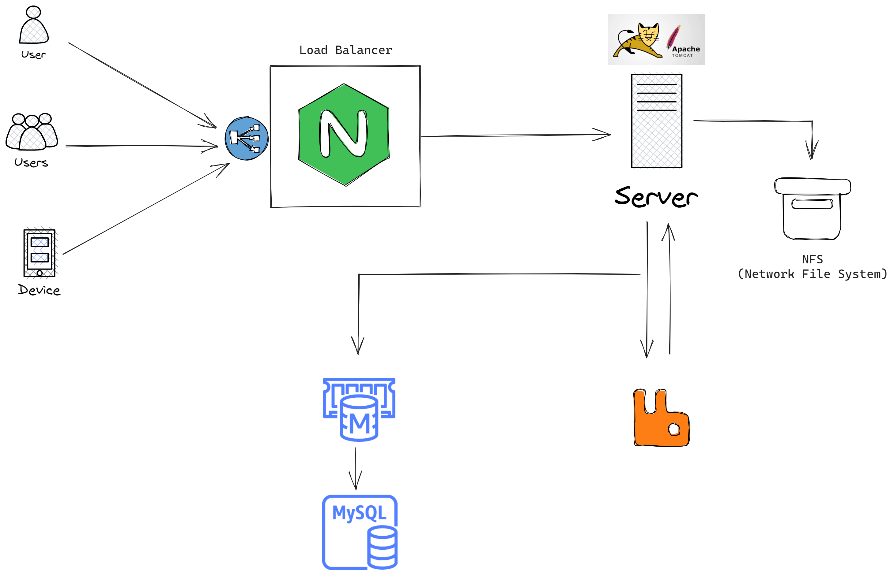

# Multi-tier Web Application Automated Provisioning

In this project, we will set up a multi-tier web application stack and it will run locally by using automated provisioning. 

## Pre-req

1. 
2. 
3.  - vagrant plugin install vagrant-host manager
4.  

## Provisioning services

1. Nginx: Web Service
2. Tomcat Apache: Application Service
3. RabbitMQ: Message Broker
4. Memcached: Database Caching
5. ElasticSearch: Index/Search service
6. MySQL: SQL Database

